# Filesystem MCP — Architecture Diagrams

Living architecture overview. Tool names match the MCP surface in `src/main.rs`.

## Module Structure

```mermaid
graph TB
    subgraph Entry["Entry Point"]
        main["main.rs — MCP Server + Tool Router"]
    end

    subgraph Core["Core Modules"]
        allowed["allowed.rs — AllowedDirs"]
        path["path.rs — Path Resolution"]
        content_plane["content_plane.rs — ContentRef / blobs"]
        fs_ops["fs_ops.rs — Read/Write/List"]
        edit["edit.rs — Text Editing"]
        diff["diff.rs — Unified Diff"]
        serde["serde.rs — FlexBool / FlexUsize"]
        schema["schema.rs — JSON Schema"]
        glob["glob.rs — Pattern Matching"]
        format["format.rs — Output Formatting"]
        logging["logging.rs — Tracing"]
    end

    subgraph FileOps["File Operations"]
        search["search.rs — Glob Search"]
        grep["grep.rs / fast_grep.rs — Content Search"]
        binary["binary.rs — Binary R/W"]
        line_edit["line_edit.rs — Line Editing"]
        bulk_edit["bulk_edit.rs — Bulk Edits"]
        watch["watch.rs — File Watch/Tail"]
    end

    subgraph Analysis["Analysis"]
        hash["hash.rs — File Hashing"]
        compare["compare.rs — File/Dir Compare"]
        stats["stats.rs — Statistics"]
        duplicates["duplicates.rs — Duplicate Finder"]
    end

    subgraph Formats["Formats"]
        archive["archive.rs — ZIP/TAR"]
        json_reader["json_reader.rs — JSON + Query"]
        pdf_reader["pdf_reader.rs — PDF Extract"]
        xlsx["xlsx.rs — Excel"]
        docx["docx.rs — Word"]
        media["media.rs — Media Files"]
    end

    subgraph Network["Network optional features"]
        http_tools["http_tools.rs — HTTP/HTTPS"]
        s3_tools["s3_tools.rs — S3"]
        screenshot["screenshot.rs — Capture"]
    end

    subgraph Runtime["Runtime"]
        process["process.rs — Command Execution"]
        memory_v2["memory_v2/ — Scoped Memory + ACL"]
        llm["llm/ — Multi-provider LLM"]
        wave2["wave2/ — System Utilities"]
        thinking["thinking/ — Sequential Thinking"]
        mcp_setup["mcp_setup/ — Client Install Matrix"]
    end

    main --> allowed
    main --> path
    main --> content_plane
    main --> fs_ops
    main --> edit
    main --> search
    main --> grep
    main --> binary
    main --> line_edit
    main --> bulk_edit
    main --> hash
    main --> compare
    main --> stats
    main --> duplicates
    main --> archive
    main --> json_reader
    main --> pdf_reader
    main --> xlsx
    main --> docx
    main --> http_tools
    main --> s3_tools
    main --> screenshot
    main --> process
    main --> watch
    main --> memory_v2
    main --> llm
    main --> wave2
    main --> thinking
```

## Module Dependency Graph

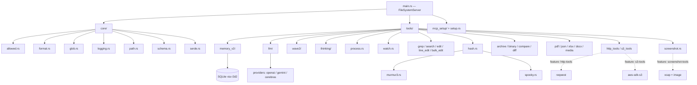

## Tool Categories

Tool names as registered on the MCP server (from `src/main.rs`). Optional feature gates noted where relevant.

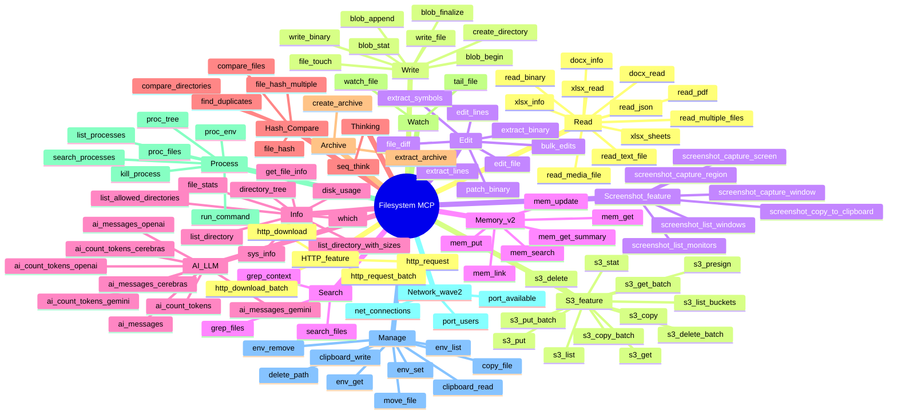

## Tool Request Pipeline

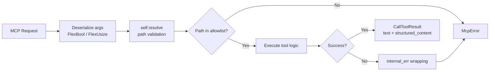

## Data Flow: MCP Request → Response

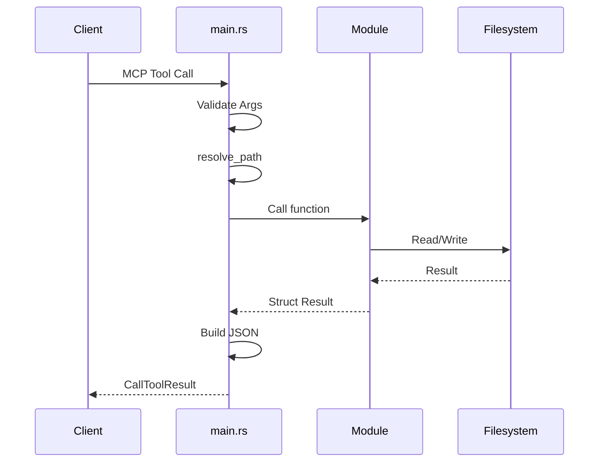

## Data Flow: run_command background + streamed logs

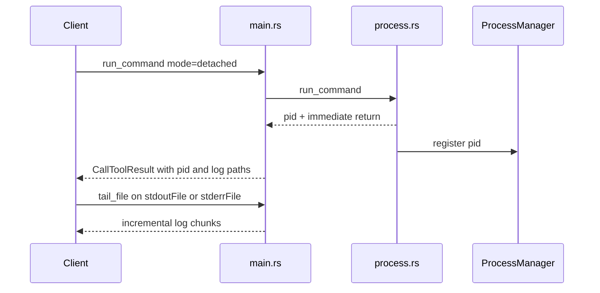

## Data Flow: http_download

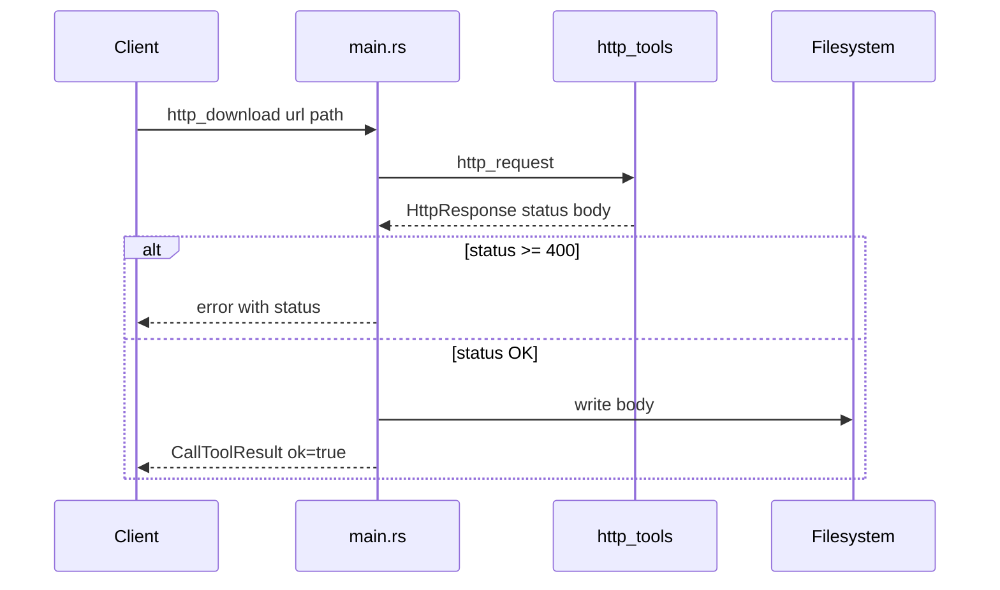

## HTTP Batch Status Handling

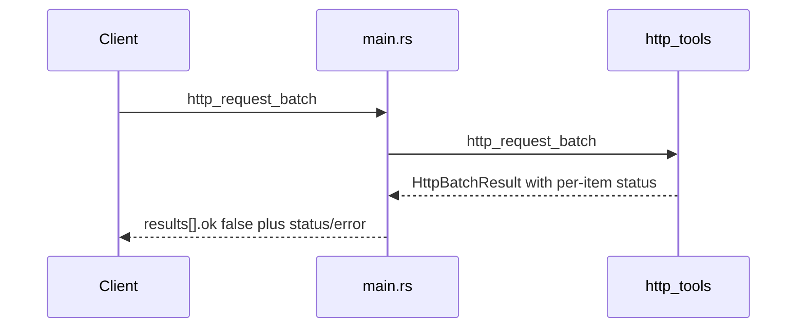

## Search Module API

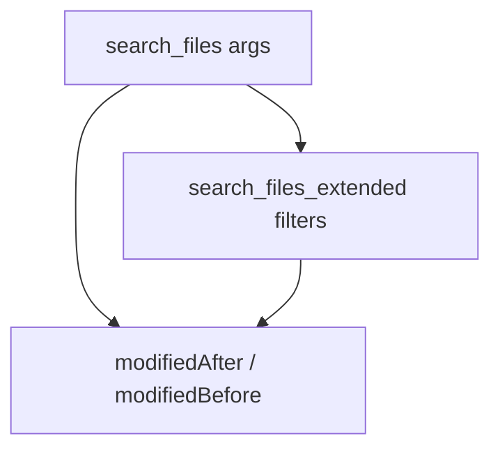

## Watch File: Missing Target Path

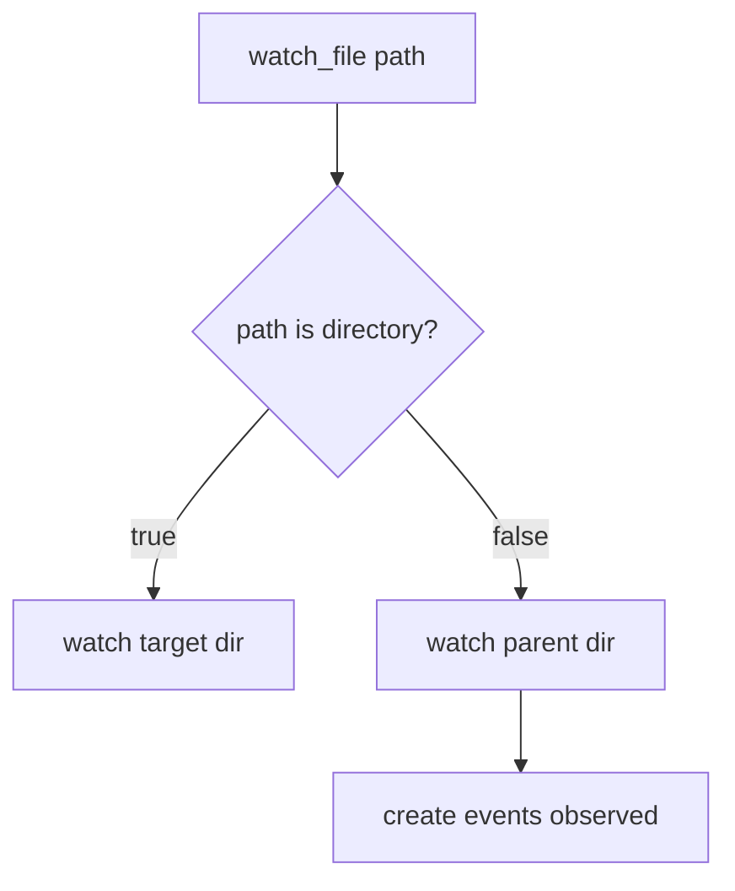

## File Watch Data Flow

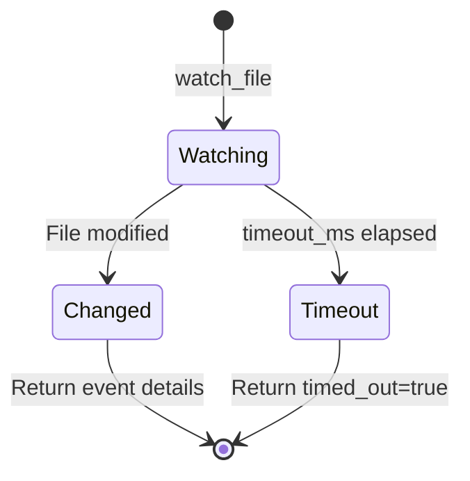

## LLM Integration Architecture

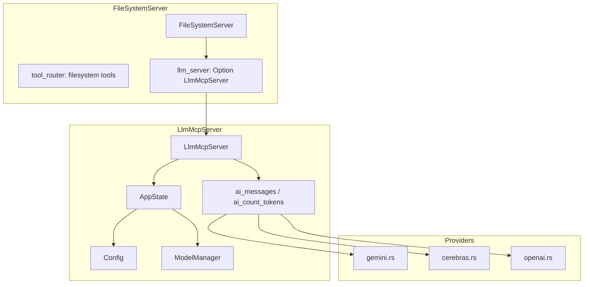

## Memory V2 Data Flow

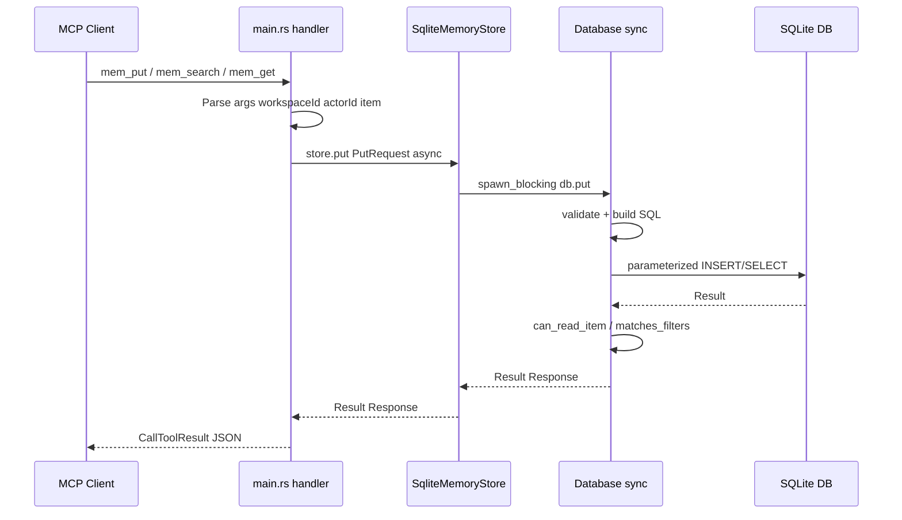

## Access Control Flow

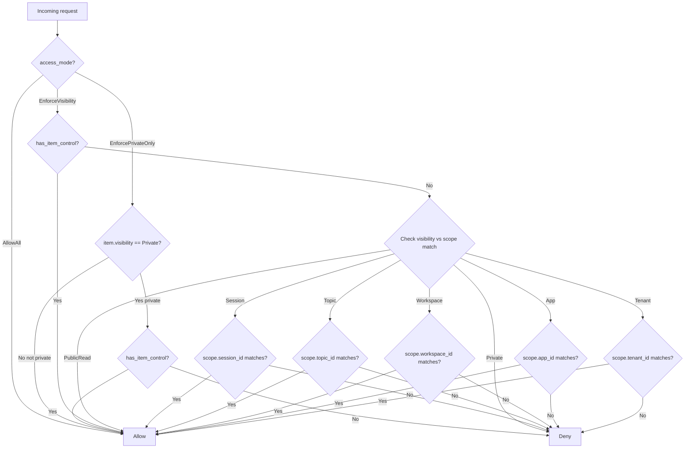

## Edit Tools: Nested Args Deserialization

`edits` accepts an array of objects, a JSON string of an array, or an array of JSON strings — via `core::serde::vec_or_string`.

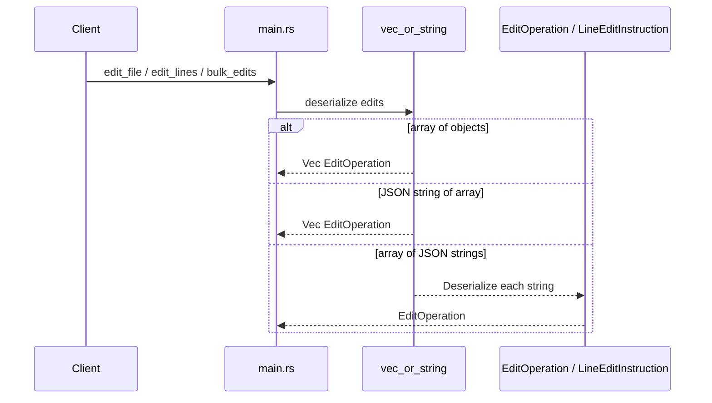
