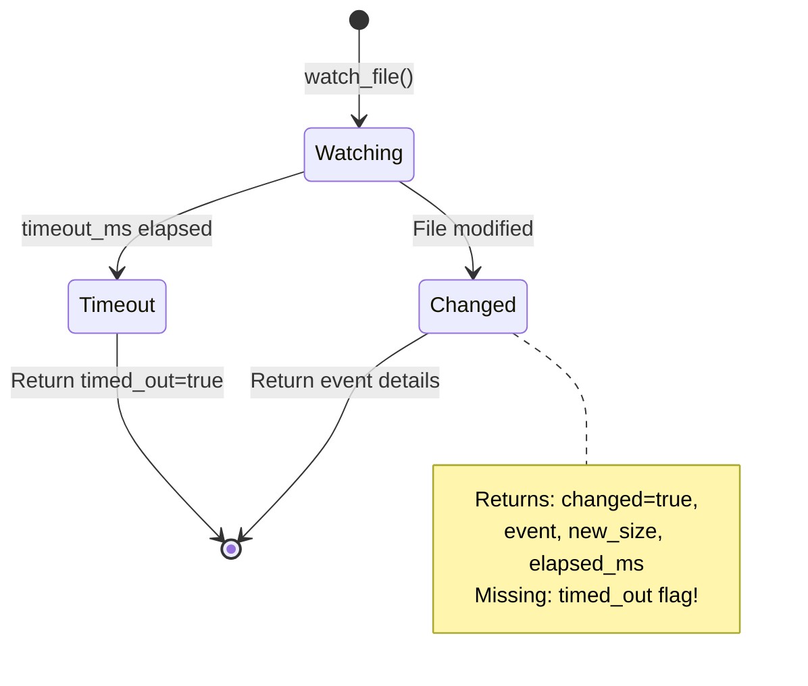

# Filesystem MCP - Architecture Diagrams

## Module Structure

```mermaid
graph TB
    subgraph "Entry Point"
        main[main.rs<br/>MCP Server + Tool Router]
    end
    
    subgraph "Core Modules"
        allowed[allowed.rs<br/>AllowedDirs]
        path[path.rs<br/>Path Resolution]
        fs_ops[fs_ops.rs<br/>Read/Write/List]
        edit[edit.rs<br/>Text Editing]
        diff[diff.rs<br/>Unified Diff]
    end
    
    subgraph "File Operations"
        search[search.rs<br/>Glob Search]
        grep[grep.rs<br/>Content Search (include/exclude)]
        binary[binary.rs<br/>Binary R/W]
        line_edit[line_edit.rs<br/>Line Editing]
        bulk_edit[bulk_edit.rs<br/>Bulk Edits]
    end
    
    subgraph "Analysis"
        hash[hash.rs<br/>File Hashing]
        compare[compare.rs<br/>File/Dir Compare]
        stats[stats.rs<br/>Statistics]
        duplicates[duplicates.rs<br/>Duplicate Finder]
    end
    
    subgraph "Formats"
        archive[archive.rs<br/>ZIP/TAR]
        json_reader[json_reader.rs<br/>JSON + Query]
        pdf_reader[pdf_reader.rs<br/>PDF Extract]
    end

    subgraph "Network"
        http_tools[http_tools.rs<br/>HTTP/HTTPS Tools]
        s3_tools[s3_tools.rs<br/>S3 Tools]
    end
    
    subgraph "Runtime"
        process[process.rs<br/>Command Execution]
        watch[watch.rs<br/>File Watch/Tail]
        logging[logging.rs<br/>Tracing]
        format[format.rs<br/>Schema Fix]
    end
    
    main --> allowed
    main --> path
    main --> fs_ops
    main --> edit
    main --> search
    main --> grep
    main --> binary
    main --> line_edit
    main --> bulk_edit
    main --> hash
    main --> compare
    main --> stats
    main --> duplicates
    main --> archive
    main --> json_reader
    main --> pdf_reader
    main --> http_tools
    main --> s3_tools
    main --> process
    main --> watch
```

## Data Flow: MCP Request → Response


## Data Flow: run_command (background)


## Dead Code Flow (to be cleaned)


## Search Module Architecture (Incomplete Refactoring)


## Tool Categories


## File Watch Data Flow


